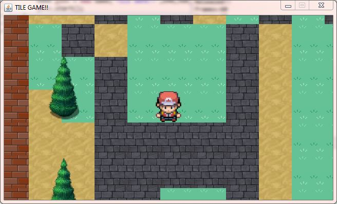

# TileGame
This is my first repository on GitHub. 

This is a 2D Tile game made using java which uses spritesheets to display the tiles of different elements in game. 
It's inspired by Pokemon Nintendo game. 
Credits : I have followed a tutorial on YouTube to make this game. You can find that playlist here : https://www.youtube.com/watch?v=dEKs-3GhVKQ&list=PLah6faXAgguMnTBs3JnEJY0shAc18XYQZ. It's very easy to follow, and has been put together really well for the beginners.

This is demo image of how this game looks like when you run it on Eclipse IDE.

Note :  
- The player cannot walkover the rock tile and brick tile.

- I need to use better tiles (especially for rocks).

- I need to strategically place the specific tiles in a way to make the game more interesting. Here I was just experimenting with how tile placement works so I was placing the tiles randomly.

- And many more things can be added :)
